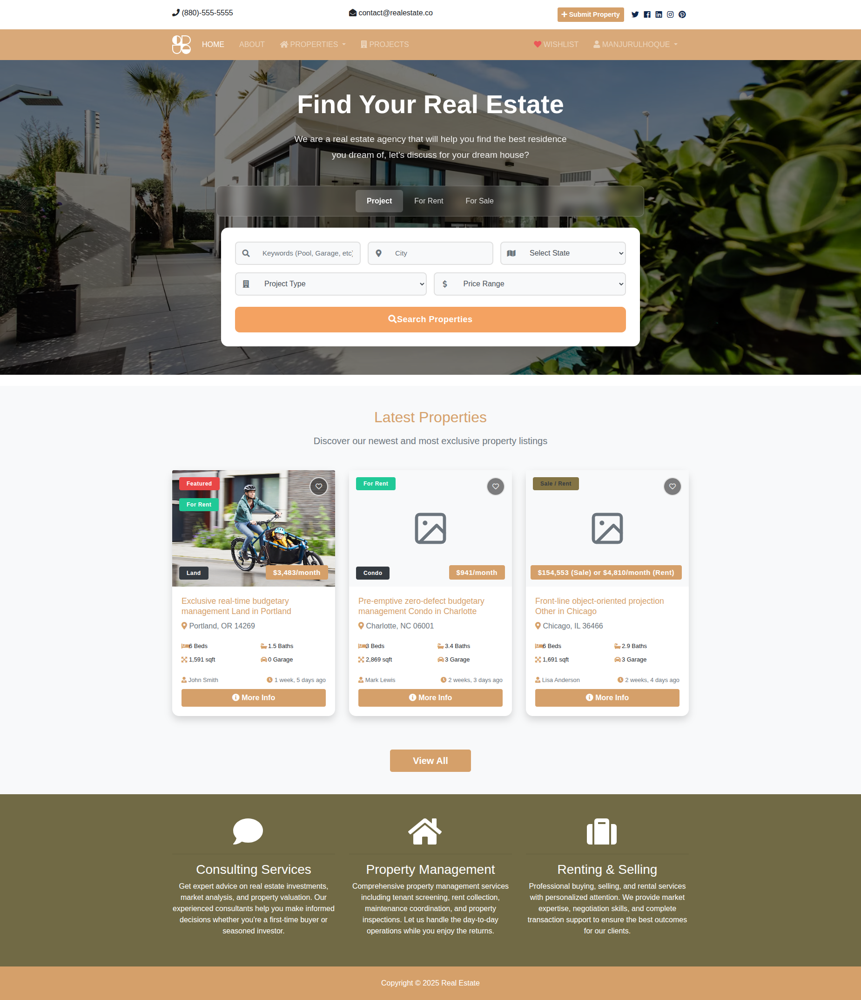
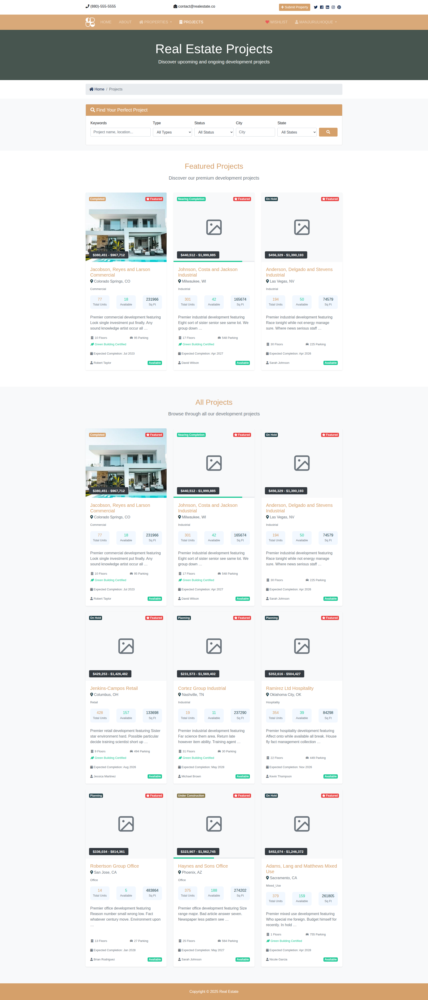
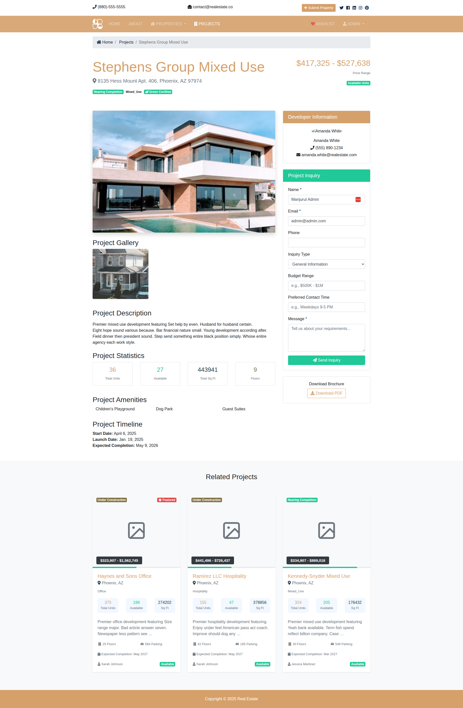
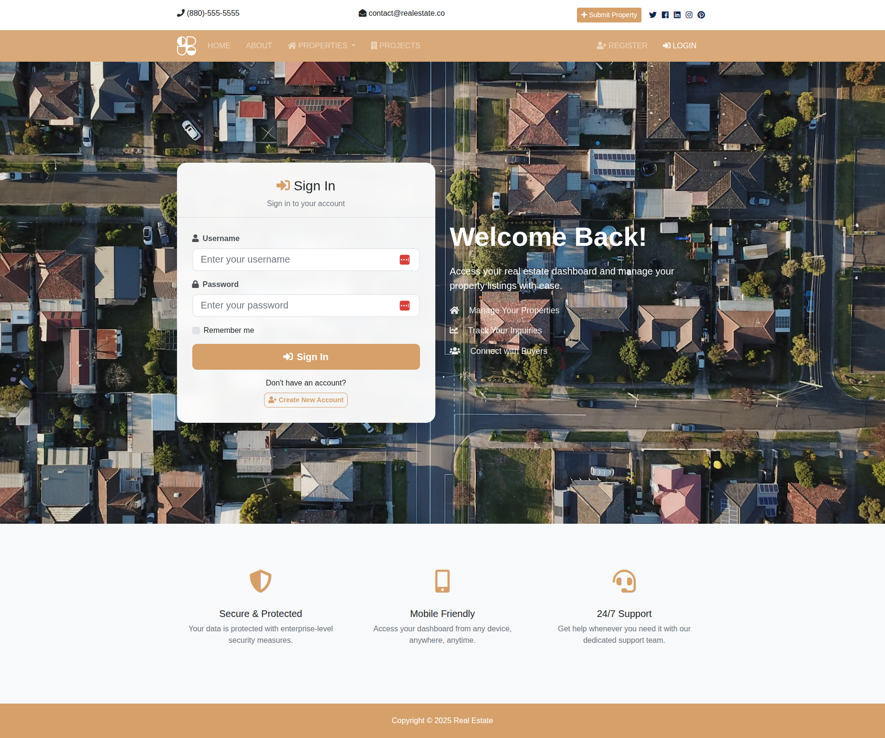
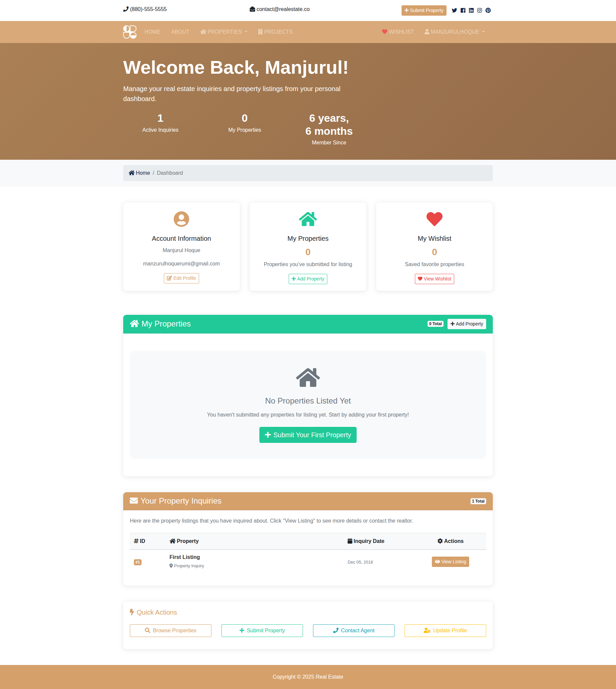
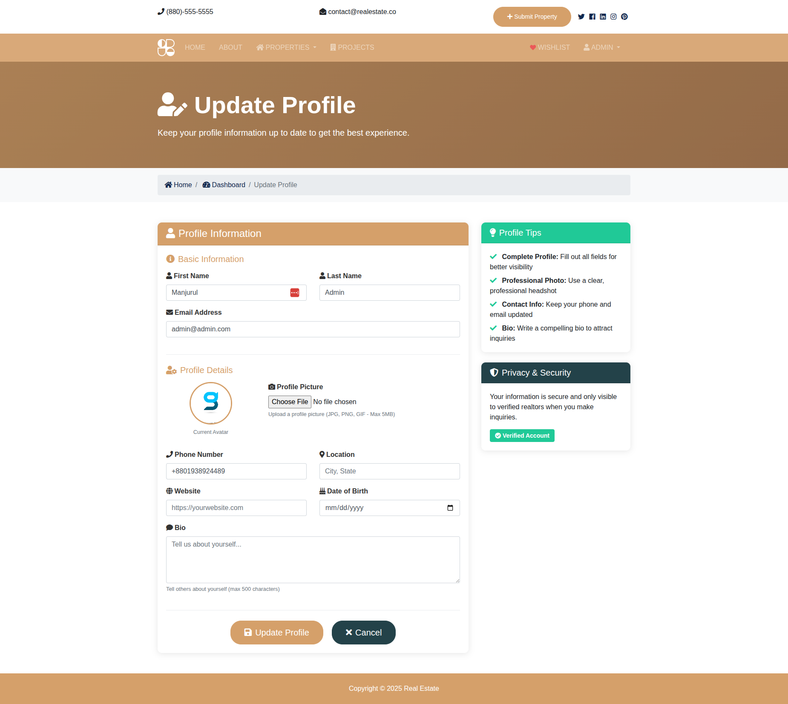
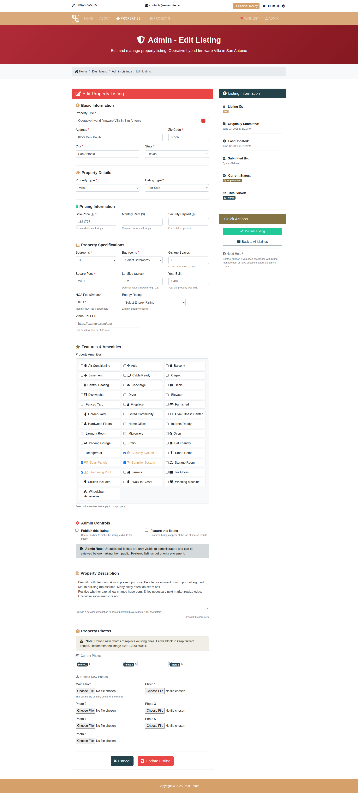
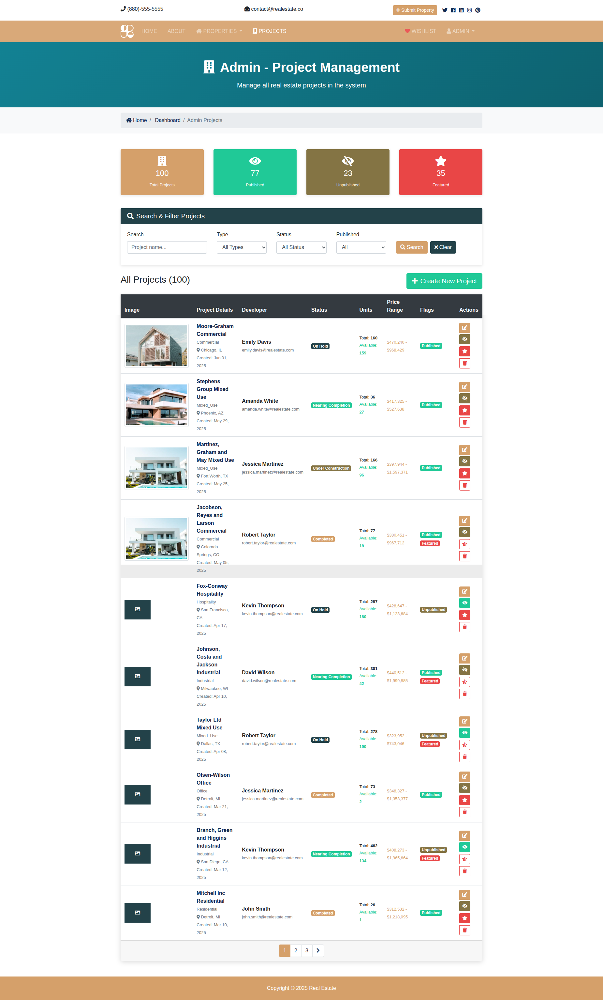
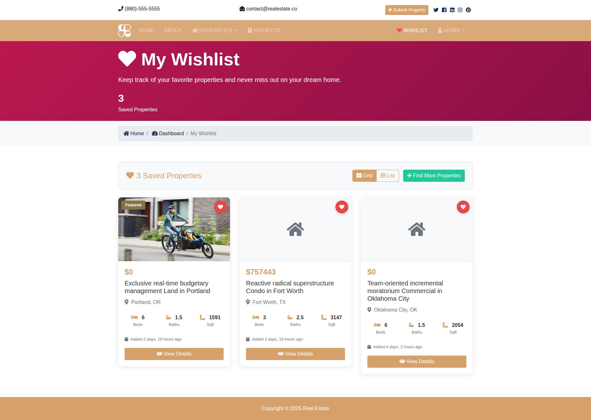

# 🏠 Django Real Estate Platform

A comprehensive, modern real estate web application built with Django that provides property listings, project management, user authentication, and advanced search capabilities.

## 🖼️ Screenshots

### Home Page


### Property Projects


### Project Details


### User Login


### User Dashboard


### Update Profile


### Update Listing


### Admin Panel


### User Wishlist


---

## 🌟 Features

### 🔍 Advanced Search & Discovery
- **Multi-tab Search Interface** with modern glass-morphism design
- **Property Search** with filters for location, price, bedrooms, property type
- **Project Search** with specialized filters for real estate developments
- **Keyword-based Search** with smart filtering capabilities
- **State-wise Filtering** with comprehensive location data

### 🏘️ Property Management
- **Property Listings** with detailed information and multiple photos
- **Property Types** including residential, commercial, and mixed-use
- **Photo Galleries** with up to 6 images per property
- **Virtual Tours** integration support
- **Property Amenities** with icon-based display
- **Energy Rating** system (A+ to F)
- **HOA Fee** tracking and display

### 🏗️ Real Estate Projects
- **Project Management** for development properties
- **Project Status Tracking** (Planning, Under Construction, Nearing Completion, Completed)
- **Progress Visualization** with completion percentages
- **Project Amenities** with detailed feature lists
- **Developer Profiles** with contact information
- **Project Timelines** with start, launch, and completion dates
- **Unit Availability** tracking and management
- **Price Range Management** for project units

### 👤 User Management & Authentication
- **User Registration & Login** with secure authentication
- **User Profiles** with customizable information
- **Dashboard** with personalized property management
- **Wishlist Functionality** with AJAX-powered save/remove
- **Property Inquiry History** tracking
- **Profile Update** capabilities

### 💬 Communication & Inquiries
- **Property Inquiries** with detailed contact forms
- **Project Inquiries** with specialized inquiry types
- **Contact Management** system
- **Realtor Contact** integration
- **Inquiry Response Tracking**

### 👨‍💼 Admin & Management
- **Super Admin Dashboard** with comprehensive controls
- **Property Management** (Create, Read, Update, Delete)
- **Project Management** with full CRUD operations
- **User Management** and role-based permissions
- **Inquiry Management** with response tracking
- **Featured Property** management
- **Publishing Controls** for properties and projects

### 🎨 Modern UI/UX
- **Responsive Design** that works on all devices
- **Modern Search Interface** with tabbed navigation
- **Interactive Property Cards** with hover effects
- **Photo Galleries** with lightbox functionality
- **Progress Bars** for project completion status
- **Toast Notifications** for user feedback
- **Modal Dialogs** for forms and interactions

## 🛠️ Technology Stack

### Backend
- **Django 5.2.3** - Web framework
- **Django REST Framework** - API development
- **SQLite3** - Database (easily configurable to PostgreSQL/MySQL)
- **Pillow** - Image processing
- **Django CORS Headers** - Cross-origin requests

### Frontend
- **Bootstrap 4** - CSS framework
- **Font Awesome** - Icon library
- **JavaScript (ES6+)** - Interactive functionality
- **jQuery** - DOM manipulation and AJAX
- **Lightbox** - Image galleries

### Development Tools
- **Faker** - Test data generation
- **Django Admin** - Backend administration
- **Django Debug Toolbar** (for development)

## 📁 Project Structure

```
src/
├── accounts/          # User authentication & profiles
├── btre/             # Main Django project settings
├── contacts/         # Contact form & inquiry management
├── listings/         # Property listings management
├── pages/            # Static pages (home, about, contact)
├── projects/         # Real estate project management
├── realtors/         # Realtor profiles & management
├── static/           # CSS, JS, and static assets
├── templates/        # HTML templates
└── media/            # User uploaded files
```

## 🚀 Quick Start

### Prerequisites
- Python 3.8+
- pip (Python package manager)
- Git

### Installation

1. **Clone the repository**
   ```bash
   git clone git@github.com:manjurulhoque/django-real-state.git
   cd django-real-estate
   ```

2. **Create and activate virtual environment**
   ```bash
   python -m venv venv
   source venv/bin/activate  # On Windows: venv\Scripts\activate
   ```

3. **Install dependencies**
   ```bash
   pip install -r requirements.txt
   ```

4. **Run database migrations**
   ```bash
   cd src
   python manage.py migrate
   ```

5. **Generate sample data (optional)**
   ```bash
   python ../generate_fixtures.py
   python manage.py loaddata fixtures.json
   ```

6. **Create superuser**
   ```bash
   python manage.py createsuperuser
   ```

7. **Run the development server**
   ```bash
   python manage.py runserver
   ```

8. **Access the application**
   - Main site: http://127.0.0.1:8000/
   - Admin panel: http://127.0.0.1:8000/admin/

## 📱 Key Features Showcase

### 🏠 Property Listings
- Comprehensive property database with search and filter capabilities
- High-quality image galleries with multiple photos per property
- Detailed property specifications including bedrooms, bathrooms, square footage
- Amenity tracking with icon-based display
- Realtor contact information and inquiry forms

### 🏗️ Real Estate Projects
- Development project management with status tracking
- Visual progress indicators showing completion percentages
- Project amenities and feature management
- Developer profiles with contact information
- Unit availability and pricing management

### 👤 User Experience
- Modern, responsive design that works on all devices
- Advanced search with tabbed interface for different property types
- Wishlist functionality with real-time updates
- User dashboard with inquiry history and saved properties
- Seamless property inquiry and contact system

### 🔧 Admin Features
- Comprehensive admin dashboard for property and project management
- User management with role-based permissions
- Inquiry management with response tracking
- Featured property management
- Publishing controls and content moderation

## 🔒 Security Features
- Django's built-in security measures
- CSRF protection on all forms
- User authentication and authorization
- Secure file upload handling
- SQL injection protection

## 📈 Scalability & Performance
- Optimized database queries with select_related and prefetch_related
- Image optimization and compression
- Pagination for large datasets
- Efficient search algorithms
- Caching support ready for production

## 🤝 Contributing
1. Fork the repository
2. Create a feature branch (`git checkout -b feature/amazing-feature`)
3. Commit your changes (`git commit -m 'Add some amazing feature'`)
4. Push to the branch (`git push origin feature/amazing-feature`)
5. Open a Pull Request

**Built with ❤️ using Django**
